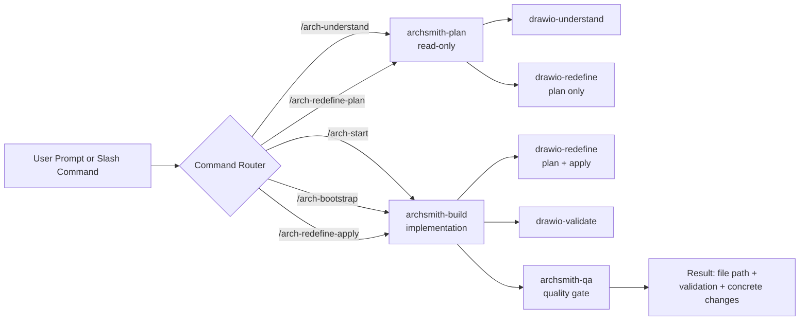
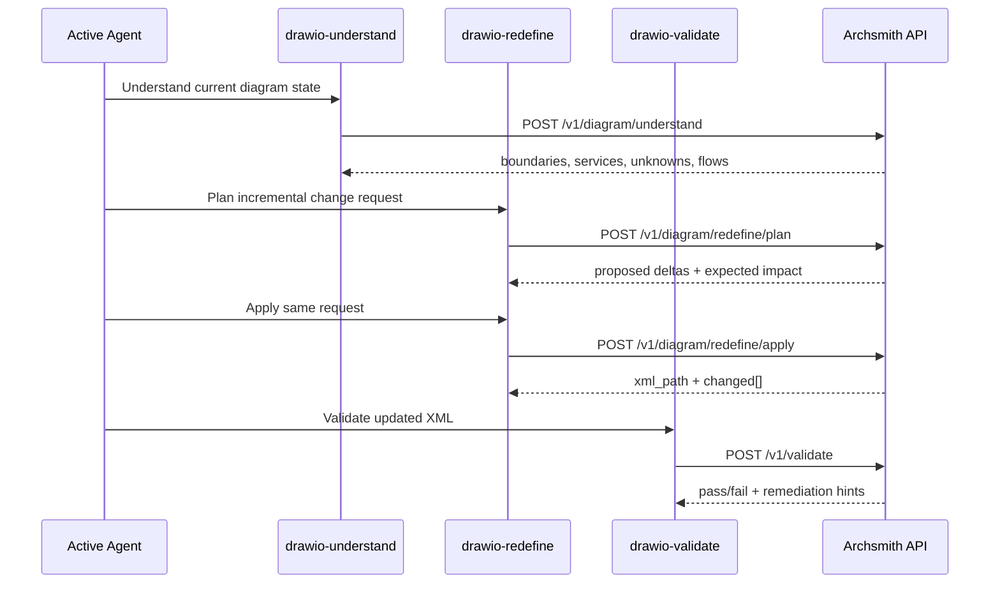
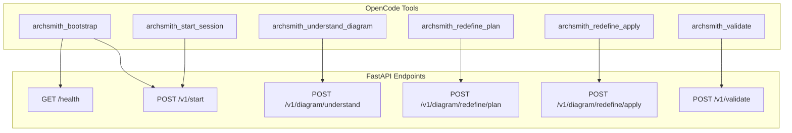

<p align="center">
  
  
  
  
  
</p>

<p align="center">
  
</p>

# 🏗️ aws-archsmith

**AI-first AWS architecture automation where Draw.io XML is the single source of truth.**

Describe your infrastructure in plain language. Archsmith generates deterministic Draw.io diagrams with official AWS4 icons, validates structure and layout, and renders publication-ready PNGs — all from the terminal.

> This entire project — every line of code, every configuration file, every agent definition — was developed exclusively with [OpenCode](https://opencode.ai) in the terminal. No IDE. No GUI. Pure CLI-driven AI development.

---

## 📑 Table of Contents

- [Features](#-features)
- [Architecture Overview](#-architecture-overview)
- [Prerequisites](#-prerequisites)
- [Installation](#-installation)
- [Quick Start](#-quick-start)
- [Three Modes of Operation](#-three-modes-of-operation)
- [Supported AWS Services](#-supported-aws-services-35)
- [Interactive CLI Commands](#-interactive-cli-commands)
- [API Reference](#-api-reference)
- [OpenCode Agent Mode](#-opencode-agent-mode)
- [Agent Composition](#-agent-composition)
- [Skills Workflow](#-skills-workflow)
- [Tools and API Map](#-tools-and-api-map)
- [Hybrid Skill Integration](#-hybrid-skill-integration-drawio-skills)
- [Diagram Mechanics](#-diagram-mechanics)
- [Repository Layout](#-repository-layout)
- [QA & Validation](#-qa--validation)
- [Environment Variables](#-environment-variables)
- [Contributing](#-contributing)
- [License](#-license)

---

## ✨ Features

| Capability | Description |
|---|---|
| 🗣️ **Natural language to diagrams** | Describe AWS architectures in plain English; Archsmith generates valid Draw.io XML |
| 🎨 **Official AWS4 icons** | Uses `mxgraph.aws4.*` stencils matching the official Draw.io AWS palette |
| 🔄 **Incremental updates** | Add, remove, reconnect services on existing diagrams without replacing them |
| ✅ **Validation-first** | Structure, overlap, and orthogonal edge checks run before every render |
| 🐳 **Docker rendering** | PNG/SVG export via headless Draw.io Desktop container |
| 🌐 **API-first architecture** | Full FastAPI server with session management, SQLite/Postgres persistence |
| 🤖 **OpenCode agent integration** | Custom agents, skills, tools, and slash commands for terminal-native workflow |
| 📦 **Compressed file support** | Read and redefine both uncompressed and compressed `.drawio` files |
| 🏗️ **Dynamic boundary detection** | Automatic VPC/subnet/account boundary classification using style + geometry heuristics |

---

## 🏛️ Architecture Overview

```
┌─────────────────────────────────────────────────────────────────┐
│                      User / AI Agent                            │
│  (Natural language: "Add API Gateway, Lambda, and DynamoDB")    │
└──────────────┬──────────────────────────┬───────────────────────┘
               │                          │
        ┌──────▼──────┐          ┌────────▼────────┐
        │  CLI Mode   │          │   API Mode      │
        │  archsmith  │          │   FastAPI:8000   │
        └──────┬──────┘          └────────┬────────┘
               │                          │
        ┌──────▼──────────────────────────▼───────┐
        │          Core Engine (Python)            │
        │  generate_xml.py  diagram_ops.py        │
        │  validate_drawio.py  session_state.py   │
        └──────┬──────────────────────────┬───────┘
               │                          │
        ┌──────▼──────┐          ┌────────▼────────┐
        │ .drawio XML │          │  SQLite/Postgres │
        │  (raw/)     │          │  (sessions, ops) │
        └──────┬──────┘          └─────────────────┘
               │
        ┌──────▼──────┐
        │  Docker      │
        │  Renderer    │
        │  (PNG/SVG)   │
        └─────────────┘
```

---

## 📋 Prerequisites

| Dependency | Required | Notes |
|---|---|---|
| **Python** 3.10+ | Yes | Core engine and CLI |
| **Docker** | Yes | API container and PNG rendering |
| **Docker Compose** plugin | Yes | `docker compose` (v2 syntax) |
| **Poetry** 1.8+ | Recommended | Dependency management (or use Docker) |
| **make** | Optional | Shortcut targets for common workflows |
| **OpenCode** | Optional | For agent mode with custom tools/commands |

---

## 📥 Installation

### 1. Clone the repository

```bash
git clone https://github.com/Tetfretguru/aws-archsmith.git
cd aws-archsmith
```

### 2. Install Python dependencies

**With Poetry (recommended):**

```bash
pip install poetry
poetry install
```

**Without Poetry (pip):**

```bash
pip install fastapi "uvicorn[standard]" sqlalchemy "pydantic>=2.9" "psycopg[binary]"
```

### 3. Initialize workspace directories

```bash
make init
```

Or manually:

```bash
mkdir -p architecture/raw architecture/rendered architecture/specs
```

### 4. Verify the setup

```bash
python3 scripts/validate_drawio.py architecture/raw  # should pass (empty dir)
docker compose version                                # confirm Docker Compose v2
```

---

## 🚀 Quick Start

### Fastest path: Interactive CLI

```bash
./archsmith
```

```text
archsmith> :start
  ✓ python3 found
  ✓ docker found
  ✓ docker compose found
  ✓ directories exist
  Ready. Use :new <name> or type a natural language prompt.

archsmith> User sends POST to API Gateway, Lambda processes it, stores in DynamoDB
  → Generated: architecture/raw/api-gateway-lambda-dynamodb.drawio
  → Validation: passed
  → Rendered: architecture/rendered/api-gateway-lambda-dynamodb.png
```

### Or with Make

```bash
make generate NAME=payments PROMPT="public ALB, ECS service, RDS postgres"
make validate
make render
```

### Full demo (generate + validate + render)

```bash
make demo
```

---

## 🔀 Three Modes of Operation

Archsmith supports three complementary interaction modes:

### 1. 🖥️ Interactive CLI

The primary local development interface. Conversational, incremental, session-aware.

```bash
./archsmith          # or: python3 scripts/archsmith_cli.py
```

```text
archsmith> :start
archsmith> public ALB, ECS Fargate service, RDS PostgreSQL
archsmith> add ElastiCache Redis between ECS and RDS
archsmith> :validate
archsmith> :render
```

Key features:
- `:start` initializes and verifies the environment
- Natural language creates or updates diagrams
- `:understand` inspects existing (including compressed) `.drawio` files
- `:redefine` previews changes; `:apply` commits them

### 2. 🌐 API Mode (FastAPI)

Headless HTTP interface for programmatic and agent-driven workflows.

**Start with SQLite (default):**

```bash
make api-up
# or: docker compose -f docker/compose.api.yml up -d --build api
```

**Start with PostgreSQL:**

```bash
make api-up-postgres
# or: docker compose -f docker/compose.api.yml --profile postgres up -d --build api-postgres postgres
```

**Verify:**

```bash
curl http://127.0.0.1:8000/health
# {"status": "ok", "database": "sqlite"}
```

**Smoke test:**

```bash
make api-smoke
```

### 3. 🤖 OpenCode Agent Mode

Full AI-agent integration with custom tools, skills, slash commands, and agents — designed for [OpenCode](https://opencode.ai) terminal sessions.

```text
/arch-bootstrap              # Start Docker + API + create session
/arch-understand             # Inspect current diagram
/arch-redefine-plan Add S3   # Preview change plan
/arch-redefine-apply Add S3  # Apply changes
```

See the [OpenCode Agent Mode](#-opencode-agent-mode) section for complete details.

---

## ☁️ Supported AWS Services (35+)

Archsmith recognizes these services by keyword and maps them to official Draw.io AWS4 icon stencils:

### 🌐 Ingress / Network Edge
`Route 53` · `CloudFront` · `WAF` · `Application Load Balancer` · `API Gateway` · `Internet Gateway`

### ⚙️ Compute / Orchestration
`ECS` · `Fargate` · `EKS` · `EC2` · `Lambda` · `AWS Batch` · `Step Functions`

### 💾 Data / Storage / Search
`RDS` · `Aurora` · `PostgreSQL` · `MySQL` · `DynamoDB` · `S3` · `ElastiCache / Redis` · `OpenSearch` · `Redshift` · `EFS`

### 📨 Messaging / Integration
`SQS` · `SNS` · `Kinesis` · `MSK` · `Amazon MQ` · `EventBridge`

### 🔐 Security / Identity / Keys
`IAM` · `KMS` · `Secrets Manager` · `Cognito` · `Shield`

### 📊 Observability
`CloudWatch` · `X-Ray` · `CloudTrail`

> Icon rendering uses the `mxgraph.aws4.resourceIcon;resIcon=mxgraph.aws4.<key>` pattern with 78x78 geometry, matching Draw.io's official AWS4 palette. Use `:icon none` for classic boxes.

---

## 💻 Interactive CLI Commands

| Command | Description |
|---|---|
| `:start` | Run startup checks and initialize session |
| `:help` | Show all available commands |
| `:new <name>` | Create a new working diagram file |
| `:use <file>` | Switch to an existing `.drawio` file |
| `:status` | Show active file and last validation/render state |
| `:validate` | Validate the active file |
| `:render` | Validate + render active file to PNG |
| `:show` | Quick summary (service and edge counts) |
| `:understand [file]` | Parse existing `.drawio` and show detected structure |
| `:redefine <request>` | Preview a redefine plan without mutating XML |
| `:apply` | Apply the last previewed redefine plan |
| `:icon <aws4\|none>` | Switch between AWS4 icons and classic boxes |
| `:quit` | Exit the CLI |

Any text that does not start with `:` is interpreted as a **natural language architecture request**.

---

## 🌐 API Reference

Base URL: `http://127.0.0.1:8000`

### Endpoints

| Method | Path | Description |
|---|---|---|
| `GET` | `/health` | Health check (includes DB status) |
| `POST` | `/v1/start` | Bootstrap session, run startup checks |
| `POST` | `/v1/chat` | Natural language create/update diagram |
| `POST` | `/v1/diagram/understand` | Inspect active diagram structure |
| `POST` | `/v1/diagram/redefine/plan` | Preview incremental changes (no mutation) |
| `POST` | `/v1/diagram/redefine/apply` | Apply incremental changes to XML |
| `POST` | `/v1/validate` | Validate a `.drawio` file or inline XML |
| `GET` | `/v1/file` | Retrieve XML content by session |
| `GET` | `/v1/session/{session_id}` | Session details and history |

### Core Flow

```
POST /v1/start
  → session_id

POST /v1/chat  { session_id, message: "ALB, ECS, RDS Postgres" }
  → xml_path, xml_content, validation, changed[]

POST /v1/chat  { session_id, message: "add ElastiCache between ECS and RDS" }
  → updated xml_path, xml_content, validation, changed[]
```

### Redefine Flow (Existing Diagrams)

```
POST /v1/diagram/understand    { session_id }
  → boundaries, services, unknowns, flows

POST /v1/diagram/redefine/plan  { session_id, message: "add EventBridge" }
  → proposed deltas (no mutation)

POST /v1/diagram/redefine/apply { session_id, message: "add EventBridge" }
  → xml_path, validation, applied changes
```

### Create-from-Scratch Mode

When no active file exists, `redefine/plan` and `redefine/apply` generate a new diagram:

```
POST /v1/diagram/redefine/apply {
  session_id: "...",
  message: "API Gateway, Lambda, DynamoDB",
  file_name: "serverless-api"
}
```

Full request/response examples: [`examples/api.http`](examples/api.http) | API docs: [`docs/API.md`](docs/API.md)

---

## 🤖 OpenCode Agent Mode

Archsmith ships with a complete [OpenCode](https://opencode.ai) agent setup for terminal-native architecture workflows.

### Components

| Type | Files | Purpose |
|---|---|---|
| **Agents** | `archsmith-plan`, `archsmith-build`, `archsmith-qa` | Planning (read-only), implementation, and QA subagent |
| **Tools** | 6 TypeScript tools in `.opencode/tools/` | API-backed wrappers: bootstrap, start, understand, plan, apply, validate |
| **Skills** | `drawio-understand`, `drawio-redefine`, `drawio-validate` | Reusable workflow recipes for diagram operations |
| **Commands** | `/arch-bootstrap`, `/arch-start`, `/arch-understand`, `/arch-redefine-plan`, `/arch-redefine-apply` | Slash commands for quick invocation |
| **Config** | `opencode.json`, `AGENTS.md` | Project-level rules, permissions, instruction loading |

### Recommended Workflow

```text
1.  /arch-bootstrap              # Start Docker + API + session (default: sqlite)
2.  /arch-bootstrap postgres     # Or start with PostgreSQL
3.  /arch-understand             # Inspect current diagram state
4.  /arch-redefine-plan <prompt> # Preview proposed changes
5.  /arch-redefine-apply <prompt># Apply changes, auto-validates
```

### Agent Architecture

- **archsmith-plan** (default agent) — Read-only planning. Proposes deltas without mutations. Cannot edit files.
- **archsmith-build** — Full implementation agent. Understands, plans, applies, and validates through API tools.
- **archsmith-qa** — QA subagent. Reviews XML validity, orthogonal edges, overlap, and boundary semantics.

### Agent Composition



- `archsmith-plan` is the default agent (`opencode.json`) and stays non-mutating.
- `archsmith-build` executes mutation workflows and reports outcomes.
- `archsmith-qa` validates architecture quality signals and returns actionable failures.

### Skills Workflow



- Skills are composable recipes: understand first, then redefine, then validate.
- Redefine remains incremental and keeps the same file unless explicitly changed.
- Validation is the mandatory gate before downstream render workflows.

### Tools and API Map



- Each tool is an API wrapper with validated args and JSON output.
- No direct Python calls from tools; communication goes through HTTP endpoints.
- `archsmith_bootstrap` is the only tool that also orchestrates Docker startup and health checks.

### Tool Design

All 6 OpenCode tools communicate exclusively through the **FastAPI HTTP API** — no direct Python calls. Each tool:

1. Accepts Zod-validated parameters
2. Calls the corresponding API endpoint
3. Returns `JSON.stringify()` output (required by OpenCode runtime)

```
archsmith_bootstrap.ts      → docker compose up + /health + /v1/start
archsmith_start_session.ts  → POST /v1/start
archsmith_understand_diagram.ts → POST /v1/diagram/understand
archsmith_redefine_plan.ts  → POST /v1/diagram/redefine/plan
archsmith_redefine_apply.ts → POST /v1/diagram/redefine/apply
archsmith_validate.ts       → POST /v1/validate
```

---

## 🎨 Hybrid Skill Integration: `drawio-skills`

Archsmith now includes the external [`drawio-skills`](https://github.com/bahayonghang/drawio-skills) (v2.2.0) as a complementary design layer. This adds YAML-first workflows, 6 built-in themes, visual replication, and academic/engineering guardrails — without replacing the native API-first AWS architecture engine.

### Two Skill Systems, One Repo

| Layer | Location | Purpose | When to Use |
|---|---|---|---|
| **Native (Archsmith)** | `.opencode/skills/` | AWS structural changes, incremental redefine, XML validation | Infrastructure architecture, VPC/subnet/account boundaries, production diagrams |
| **External (drawio)** | `.agents/skills/drawio/` | YAML-first design, theming, replicate, academic figures | Visual refinement, presentations, non-AWS diagrams, replication from reference images |

### Decision Router

```
Is this an AWS infrastructure change?
├── YES → Use native skills (drawio-understand → drawio-redefine → drawio-validate)
│         Commands: /arch-redefine-plan, /arch-redefine-apply
│         Validation: scripts/validate_drawio.py (mandatory)
│
└── NO → Is this visual refinement, theming, or replication?
    ├── YES → Use external drawio skill
    │         Routes: /drawio create, /drawio edit, /drawio replicate
    │         Themes: tech-blue, academic, academic-color, nature, dark, high-contrast
    │
    └── HYBRID → Start with native for structure, then external for visual polish
```

### Available Themes (External Skill)

| Theme | Best For |
|---|---|
| `tech-blue` | Engineering and system architecture |
| `academic` | IEEE/paper figures (grayscale-safe) |
| `academic-color` | Paper figures with color |
| `nature` | Organic/green palettes |
| `dark` | Dark mode presentations |
| `high-contrast` | Accessibility and print |

### Installation

The external skill is installed via:

```bash
npx skills add https://github.com/bahayonghang/drawio-skills --skill drawio
```

After installation, restart your OpenCode client to reload skills.

### Artifact Conventions

| Route | Output Location | Artifacts |
|---|---|---|
| Native (AWS) | `architecture/raw/` | `.drawio` only (XML source of truth) |
| External (visual) | project root or `architecture/raw/` | `.drawio` + `.spec.yaml` + `.arch.json` (canonical bundle) |

> **Rule**: Any diagram entering `architecture/raw/` as a production artifact must pass `scripts/validate_drawio.py` regardless of which skill generated it.

### Repository Layout (Updated)

```
aws-archsmith/
├── 📂 .opencode/skills/              # Native Archsmith skills (API-first)
│   ├── drawio-understand/            #   Inspect diagram state
│   ├── drawio-redefine/              #   Plan + apply incremental changes
│   └── drawio-validate/              #   Validate XML structure
│
├── 📂 .agents/skills/drawio/         # External drawio-skills (YAML-first)
│   ├── SKILL.md                      #   Skill definition and routing
│   ├── references/                   #   Workflows, design system, docs
│   ├── scripts/                      #   CLI, DSL compiler, SVG renderer
│   ├── assets/                       #   Themes and sample diagrams
│   └── evals/                        #   Evaluation fixtures
```

---

## 📐 Diagram Mechanics

### XML Structure

Archsmith generates valid uncompressed Draw.io `mxGraphModel` XML:

- **Vertices**: `mxCell` elements with explicit `mxGeometry` (`x`, `y`, `width`, `height`)
- **Edges**: `mxCell` elements with `edgeStyle=orthogonalEdgeStyle` and arrowhead markers
- **Boundaries**: VPC (dashed), public/private subnets as container elements
- **Root cells**: `mxCell` ids `0` (root) and `1` (default parent) are always present

### Layout Strategy

Services are grouped by architectural tier and auto-connected:

```
Ingress → Compute/Messaging → Data
Security and Observability bridge into Compute
```

- Minimum spacing: 40px between sibling nodes
- Public ingress: positioned left/top
- Data services: positioned right/bottom
- VPC/subnet boundaries: auto-detected via style tokens and geometry heuristics

### Validation Rules

Every mutation triggers validation before rendering:

1. **Structure** — Valid XML root, required base cells, geometry on all vertices
2. **Layout** — No overlapping sibling nodes (40px minimum gap)
3. **Edges** — All connectors use orthogonal routing (`edgeStyle=orthogonalEdgeStyle`)

---

## 📂 Repository Layout

```
aws-archsmith/
├── 📄 archsmith                  # Shell wrapper → archsmith_cli.py
├── 📄 opencode.json              # OpenCode project config & permissions
├── 📄 AGENTS.md                  # Agent behavioral rules
├── 📄 Makefile                   # Make targets for all workflows
├── 📄 pyproject.toml             # Poetry project definition
│
├── 📂 scripts/
│   ├── archsmith_cli.py          # Interactive AI-first CLI (303 lines)
│   ├── opencode_api_server.py    # FastAPI server (304 lines)
│   ├── generate_xml.py           # Deterministic Draw.io XML generator
│   ├── diagram_ops.py            # Understand, plan, apply operations
│   ├── validate_drawio.py        # XML structure/layout validator
│   ├── session_state.py          # CLI session state dataclass
│   ├── render.sh                 # Docker-based PNG/SVG export
│   ├── api_smoke.py              # API smoke test
│   ├── qa_smoke.py               # QA automation suite
│   └── api/
│       ├── schemas.py            # Pydantic request/response models
│       ├── service.py            # Business logic layer
│       └── db.py                 # SQLAlchemy models & DB helpers
│
├── 📂 docker/
│   ├── Dockerfile.api            # Python 3.10 slim + Poetry API image
│   ├── compose.api.yml           # API service (SQLite + Postgres profiles)
│   └── compose.yml               # Renderer (drawio-desktop-headless)
│
├── 📂 architecture/
│   ├── raw/                      # Source .drawio XML files
│   ├── rendered/                 # Generated PNG/SVG outputs
│   └── specs/                    # QA test fixtures and reports
│
├── 📂 .opencode/
│   ├── agents/                   # archsmith-plan, archsmith-build, archsmith-qa
│   ├── tools/                    # 6 API-backed TypeScript tools
│   ├── skills/                   # drawio-understand, drawio-redefine, drawio-validate
│   └── commands/                 # Slash commands for OpenCode
│
├── 📂 .agents/
│   └── skills/
│       └── drawio/               # External drawio-skills (YAML-first, v2.2.0)
│           ├── SKILL.md          # Skill definition, routing, and rules
│           ├── references/       # Workflows (create/edit/replicate), design system
│           ├── scripts/          # CLI, DSL compiler, math, SVG renderer
│           ├── assets/           # 6 themes + sample diagrams
│           └── evals/            # Evaluation fixtures
│
├── 📂 docs/
│   ├── API.md                    # API endpoint reference
│   ├── USER_GUIDE.md             # Interactive CLI user guide
│   ├── API_TEST_RUN.md           # Manual API test run record
│   └── PRD_DRAWIO_SKILL_INTEGRACION.md  # Integration PRD
│
└── 📂 examples/
    └── api.http                  # HTTP request samples
```

---

## ✅ QA & Validation

### Automated Smoke Suite

```bash
make qa-smoke
# or: python3 scripts/qa_smoke.py
```

The QA suite covers 12 test cases:

| ID | Test |
|---|---|
| TP-01 | Preflight environment checks |
| TP-02 | Directory initialization |
| TP-03 | End-to-end with Make |
| TP-04 | End-to-end without Make |
| TP-05 | XML structure validation |
| TP-06 | Base cell ID requirements |
| TP-07 | Geometry validation |
| TP-08 | Overlap detection |
| TP-09 | Orthogonal edge enforcement |
| TP-10 | Render gate (validation before render) |
| TP-11 | Iterative incremental updates |
| TP-12 | Docker fallback handling |

### API Smoke Test

```bash
make api-smoke
# or: python3 scripts/api_smoke.py --base-url "http://127.0.0.1:8000"
```

### Manual Validation

```bash
# Validate all files
make validate

# Validate a single file
python3 scripts/validate_drawio.py architecture/raw/my-diagram.drawio
```

---

## ⚙️ Environment Variables

| Variable | Default | Description |
|---|---|---|
| `ARCHSMITH_DB_URL` | `sqlite:////data/archsmith.db` | Database connection string (SQLite or PostgreSQL) |
| `ARCHSMITH_API_URL` | `http://127.0.0.1:8000` | API base URL (used by OpenCode tools) |

These are set automatically in Docker containers. Override only for custom deployments.

---

## 🔧 Make Targets

```
make help              Show all targets
make init              Create workspace directories
make generate          Generate .drawio XML from prompt
make validate          Validate all .drawio files
make render            Validate + render PNG via Docker
make render-all        Validate + render PNG + SVG
make demo              Generate + validate + render
make start             Interactive CLI with startup checks
make chat              Interactive natural language mode
make api-up            Start API container (SQLite)
make api-up-postgres   Start API container (PostgreSQL)
make api-down          Stop API container
make api-smoke         Run API smoke test
make qa-smoke          Run QA automation suite
make clean             Remove rendered outputs
```

---

## 🤝 Contributing

1. Fork the repository
2. Create a feature branch from `main`
3. Ensure `make validate` and `make qa-smoke` pass
4. Submit a pull request with a clear description of changes

Development guidelines are defined in:
- `ARCHITECT_GUIDELINES.md` — XML constraints and design rules
- `INSTRUCTIONS.md` — Required workflow (validation before rendering)
- `AGENTS.md` — Agent behavioral rules

---

## 📄 License

This project is provided as-is for internal and educational use.

---

<p align="center">
  <sub>Built entirely with <a href="https://opencode.ai">OpenCode</a> in the terminal — no IDE, no GUI, pure CLI-driven AI development.</sub>
</p>
